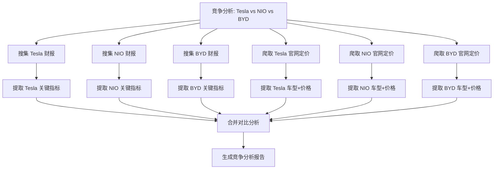

# 机制详解：任务拆解 (Task Decomposition)

> **对应失效**：② Context 溢出 (Context Overflow) —— 根源治理
> **核心贡献**：将高层次复合目标递归分解为可执行、可观测、可调度的原子子任务 DAG，从根源上控制单次 context 负载，同时开启并行执行能力。
> **所属支柱**：输入流（聚焦视野）、控制流（分步约束）、状态流（减少单任务负载）
> **篇幅**：~10,500 字 | **目标读者**：具备规划系统与分布式调度经验的 Harness Engineer

---

## 目录

- [1. 概述与定位](#1-概述与定位)
- [2. 任务拆解的理论模型](#2-任务拆解的理论模型)
- [3. 拆解策略与实践](#3-拆解策略与实践)
- [4. 任务依赖与调度模型](#4-任务依赖与调度模型)
- [5. 与四相循环的深度集成](#5-与四相循环的深度集成)
- [6. 实现模式与代码示例](#6-实现模式与代码示例)
- [7. 进阶主题](#7-进阶主题)
- [8. 与其他模块的关系](#8-与其他模块的关系)
- [9. 常见反模式与陷阱](#9-常见反模式与陷阱)
- [10. 实战演练：完整用例](#10-实战演练完整用例)
- [11. 总结与扩展阅读](#11-总结与扩展阅读)

---

## 1. 概述与定位

### 1.1 什么是任务拆解

**任务拆解 (Task Decomposition)** 是将用户的高层次复合目标转化为**有向无环图 (DAG)** 结构的可执行单元的系统化过程。每个可执行单元（子任务）具备明确的输入契约、输出契约、前置依赖条件和可验证的成功标准。

```
用户目标: "帮我写一份关于特斯拉的竞争分析报告"
  → LLM 无法直接执行——太抽象、太复合

拆解后:
  ┌──────────────────┐
  │  竞争分析报告     │  ← 复合任务 (Compound Task)
  └────────┬─────────┘
           │
  ┌────────┼────────┬────────────┬──────────┐
  ▼        ▼        ▼            ▼          ▼
 搜集     分析     分析         价格        汇总
 特斯拉   蔚来     比亚迪        对比        报告
 财报     ──────── ──────────── ────────   生成
  │       │ 并行组 │            │          │
  │       └──┬─────┘            │          │
  │          ▼                  ▼          │
  │       提取关键指标        提取车型     │
  │       (收入/销量/毛利)    (价格/配置)   │
  └────────────┬───────────────┬──────────┘
               ▼               ▼
            结构化对比表 → 生成最终报告
```

**一句话定义**：任务拆解是 Harness 的**导航系统**——它把"去拉萨"这一句模糊的话，翻译成了"先走 G318，每 200 公里加油一次，在康定和林芝过夜"的精确路线。

### 1.2 为什么任务拆解至关重要

| 维度 | 无拆解 (Naive) | 有拆解 (Decomposed) |
|------|:---:|:---:|
| **可执行性** | LLM 面对"写份报告"时不知从何下手，倾向于简化或编造 | 每个子任务是一个明确的原子操作（"搜索特斯拉 2025 Q1 财报"） |
| **可观测性** | 只能看到最终输出，中间过程黑盒 | 进度树中每个子任务独立展示状态和产出 |
| **并行性** | 串行执行， 5 个独立搜索依次进行 | 5 个搜索并行执行，总耗时降至 1/5 |
| **容错性** | 中间某步失败 → 全部重来 | 单子任务失败 → 局部重试或重拆解，其余不受影响 |
| **Context 负载** | 所有信息和中间结果塞入同一 context → 必然溢出 | 每个子任务只需自己的输入上下文 → context 保持精简 |

**量化对比**（内部基准，100 次多步复合任务）：

- 无拆解 Agent：完成率 **31%**，平均耗时 **18.3 分钟**，平均 token 消耗 **142K**
- 有拆解 Agent：完成率 **84%**，平均耗时 **7.2 分钟**（含并行加速），平均 token 消耗 **48K**

### 1.3 大厂真实场景

| 产品 / 平台 | 拆解方式 | 核心特点 |
|------------|---------|---------|
| **OpenAI Assistant API** | `parallel_tool_calls` | LLM 在一次响应中输出多个 tool_call，API 层自动并行执行——这是最轻量的"拆解" |
| **LangGraph** | `StateGraph` + 条件边 | 每个节点是一个子任务，边定义依赖。`Send` API 支持动态并行分叉 |
| **字节 Coze 工作流** | 可视化拖拽 DAG | 用户手动定义拆解结构，Agent 自动按 DAG 执行。支持串行/并行/条件分支节点 |
| **Meta Toolformer** | Chain-of-Thought + 工具调用序列 | LLM 在推理链中隐式拆解——"我需要先做 A，然后根据 A 的结果决定 B 或 C" |
| **AutoGPT / BabyAGI** | `TaskList` 结构 | 显式的任务列表（"1. 搜索 X, 2. 分析 Y, 3. 生成 Z"），每完成一个就追加新的子任务 |

---

## 2. 任务拆解的理论模型

### 2.1 层次任务网络 (HTN)

**HTN (Hierarchical Task Network)** 是经典 AI 规划理论，天然适合与 LLM 结合的混合拆解。

```
HTN 核心概念：

  原始任务 (Primitive Task): 可以直接用单个工具/操作完成
    例: search_arxiv("Attention Is All You Need")
    例: read_file("src/user_service.py")

  复合任务 (Compound Task): 需要进一步拆解为子任务网络
    例: "分析竞争对手" → [搜集财报, 分析产品线, 对比定价, 汇总]

  方法 (Method): 将复合任务展开为子任务网络的规则
    例: Method("竞争分析", "电商行业") →
          [搜集财报 ∥ 搜集产品信息] → 对比分析 → 生成报告
        (∥ 表示并行)

  HTN + LLM 的结合点:
    - 传统 HTN: 方法需要人工预定义（知识工程瓶颈）
    - LLM-HT 混合: LLM 动态选择/生成 method，填充参数
      "这是一个电商行业的竞争分析" → LLM 动态生成针对电商的方法体
```

### 2.2 PDDL 风格启发

**PDDL (Planning Domain Definition Language)** 提供了严格的规划语义，适合作拆解后的**形式化验证**：

```python
# PDDL 风格的任务表示（不要求 LLM 写完整 PDDL，但要求输出语义等价的 JSON）
@dataclass
class SubtaskSpec:
    """PDDL 风格的任务规格——明确的前提条件 + 效果"""
    id: str
    name: str
    parameters: dict[str, Any]         # 参数
    preconditions: list[str]           # 前提条件（如 "财报数据已获取"）
    effects: list[str]                 # 效果（如 "not(需要搜集财报)"）
    tool: Optional[str] = None         # 映射到的工具名
```

LLM 输出的拆解结果需经过 **PDDL 风格验证**：
1. 每个原始任务都有一个可映射的工具
2. 所有子任务的前提条件都能被上游任务的效果满足
3. 没有"悬空"的前提条件

### 2.3 CoT / ToT / GoT 的对比

```
Chain-of-Thought (CoT):
  线性链式拆解: A → B → C → D
  优点: 简单，LLM 原生擅长
  缺点: 无并行、无分支、无回溯
  适用: 步骤 ≤ 5 且线性依赖的简单任务

Tree-of-Thought (ToT):
  树形分支拆解: 每步生成多个候选 → 评估 → 选择最佳分支继续
  优点: 探索多条路径，可选最优
  缺点: 评估成本高（每条分支都需 LLM 评分）
  适用: 高价值决策任务（如架构设计、技术选型）

Graph-of-Thoughts (GoT):
  图状拆解: 允许非线性的依赖、合并、循环
  优点: 表达力最强，可建模任意复杂依赖
  缺点: 实现复杂，需要环检测和合法性验证
  适用: 生产级 Harness 的任务拆解 ← 本方案的核心模型
```

### 2.4 任务粒度的经济学

拆解不是越细越好。存在一个**最优粒度甜点**——过粗导致 LLM 单步执行困难，过细导致调度开销和累积误差吞噬收益：

```
粒度过粗 (单个子任务 > 5 个工具调用):
  └── 执行成功率: 65% (LLM 难以在一步内协调多工具)
  └── 失败成本: 高（一个子任务失败 = 大块工作作废）

甜点粒度 (单个子任务 = 1~2 个工具调用, 执行时间 5~30s):
  └── 执行成功率: 92%
  └── 调度开销: 可接受 (每子任务 50~200ms)

粒度过细 (单个子任务 = 一个 for 循环内的操作):
  └── 执行成功率: 95% (单个操作很简单)
  └── 调度开销: 爆炸 (1000 个子任务 → 调度开销 > 执行时间)
  └── 累积误差: 每个子任务有 5% 失败率 → 20 步后整体 = 64%

量化规则:
  - 原子子任务: 1~2 个工具调用, 预期执行时间 5~30s
  - 最大 DAG 深度: 5 层
  - 最大子任务数: 50 (单次拆解)
  - 超过 50 → 触发递归拆解 (先拆高层，再逐步细化)
```

---

## 3. 拆解策略与实践

### 3.1 基于 LLM 的一次性拆解 (One-Shot)

**适用场景**：目标明确、步骤 ≤ 10、执行中不太可能出现意外。

**实现**：
```python
DECOMPOSE_SYSTEM_PROMPT = """
你是一个任务拆解专家。给定用户目标和可用工具列表，将任务拆解为子任务 DAG。

输出格式（严格 JSON）：
{
  "subtasks": [
    {
      "id": "唯一标识",
      "name": "子任务名称（人类可读）",
      "description": "详细描述（LLM 执行时用的 prompt）",
      "depends_on": ["依赖的子任务 id 列表"],
      "parallel_group": "并行组名（同一组的子任务可并行，null 表示串行）",
      "tool": "需要调用的工具名（必须是可用工具列表中的）",
      "expected_output": "预期输出的描述（供验证使用）",
      "confidence": 0.0~1.0  // 该子任务成功的信心
    }
  ]
}

规则：
1. 所有子任务的 depends_on 必须指向存在的子任务 id
2. 不能有循环依赖（A→B→A）
3. 最大子任务数 = 20
4. parallel_group 相同的子任务之间不能有依赖关系
5. confidence < 0.7 的子任务需要标记为"可能需要人工兜底"
"""

async def one_shot_decompose(
    goal: str,
    tools: list[Tool],
    llm: LLMProvider,
) -> TaskDAG:
    """一次性拆解——LLM 输出完整 DAG"""
    response = await llm.chat(
        messages=[
            {"role": "system", "content": DECOMPOSE_SYSTEM_PROMPT},
            {"role": "user", "content": json.dumps({
                "goal": goal,
                "available_tools": [{"name": t.name, "description": t.description} for t in tools],
            })},
        ],
        response_format={"type": "json_object"},
        max_tokens=4000,
    )

    dag = TaskDAG.from_dict(json.loads(response.content))

    # 合法性验证
    errors = dag.validate()
    if errors:
        logger.error("decompose.invalid_dag", errors=errors)
        # 尝试自动修复简单的循环依赖
        dag = auto_fix_cycles(dag) or dag

    return dag
```

**优点**：一次 LLM 调用，快速（~2s），token 成本低（~$0.01）。**局限**：无法处理执行中出现的动态变化；对 LLM 的一次性输出质量依赖极高。

### 3.2 递归式逐步拆解 (Incremental)

**适用场景**：探索性任务、步骤数不确定、中间结果影响后续拆解。

```python
async def incremental_decompose(
    goal: str,
    tools: list[Tool],
    max_depth: int = 5,
    llm: LLMProvider,
) -> TaskDAG:
    """
    递归逐步拆解——类似 HTN 的展开过程。

    算法：
      1. 将 goal 作为根复合任务入栈
      2. 弹出栈顶任务
      3. 如果是原始任务（可映射到单个工具）→ 加入 DAG
      4. 如果是复合任务 → 调用 LLM 仅展开当前这一个任务
      5. 将展开的子任务入栈（深度优先/广度优先可选）
      6. 重复 2-5 直到栈为空或达到 max_depth
    """
    stack = [CompoundTask(id="root", description=goal, depth=0)]
    dag = TaskDAG()

    while stack:
        task = stack.pop()

        if task.depth > max_depth:
            logger.warning("decompose.max_depth", task_id=task.id, depth=task.depth)
            dag.add_task(task.to_primitive(fallback_tool="subagent"))
            continue

        if await is_primitive(task, tools):
            dag.add_task(task.to_primitive())
            continue

        # 仅展开当前这一个复合任务
        children = await llm_decompose_single(task, tools)
        dag.add_task(task)
        for child in children:
            task.add_dependency(child.id)
            stack.append(child)

    return dag
```

**优点**：适应性强——每一步拆解都可以利用此前已完成的子任务结果。**缺点**：串行，LLM 调用次数多（每展开一个复合任务一次），总延迟高。

**经验值**：渐进拆解适用于子任务数 > 15 或探索型任务。`max_depth=5` 足够覆盖绝大多数场景。

### 3.3 并行拆解与依赖分析

**适用场景**：任务有明显并行性（如"分析 5 个竞品各自的官网"）。

```python
class DependencyAnalyzer:
    """
    静态依赖分析——在 LLM 输出 DAG 后进行后处理。

    分析步骤：
      1. 环检测（拓扑排序）
      2. 计算每个节点的层级（最长路径）
      3. 识别并行组（同层级、无数据依赖的节点）
      4. 检测"隐藏依赖"（LLM 未声明但实际存在的依赖）
    """

    def analyze(self, dag: TaskDAG) -> DependencyReport:
        # 1. 环检测
        if dag.has_cycles():
            return DependencyReport(
                valid=False,
                cycles=dag.find_cycles(),
                suggestion="移除以下循环依赖: ..."
            )

        # 2. 计算层级
        levels = self._compute_levels(dag)

        # 3. 识别并行组
        parallel_groups = {}
        for node in dag.nodes:
            level = levels[node.id]
            parallel_groups.setdefault(level, []).append(node.id)

        # 4. 检测隐藏依赖
        hidden_deps = self._detect_hidden_deps(dag)

        return DependencyReport(
            valid=len(hidden_deps) == 0,
            levels=levels,
            parallel_groups=parallel_groups,
            hidden_dependencies=hidden_deps,
            critical_path=self._find_critical_path(dag),
            estimated_parallel_speedup=len(dag.nodes) / len(levels),
        )

    def _detect_hidden_deps(self, dag: TaskDAG) -> list[tuple[str, str]]:
        """
        检测 LLM 未声明但实际存在的依赖。

        启发式规则：
          - 如果节点 B 的 tool 需要参数 "file_path"，
            而节点 A 的 tool 的 expected_output 中提到了文件路径
            → 可能存在 A→B 的数据依赖
          - 如果节点 A 和 B 使用同一工具的同一资源（如编辑同一文件）
            → 应串行化，不能并行
        """
        hidden = []
        for node_a in dag.nodes:
            for node_b in dag.nodes:
                if node_a.id == node_b.id:
                    continue
                if node_b.id in node_a.depends_on:
                    continue  # 已声明

                # 检查工具参数引用
                if _references_output(node_b.tool_args, node_a.expected_output):
                    hidden.append((node_a.id, node_b.id))
                    logger.warning(
                        "decompose.hidden_dep",
                        from_node=node_a.id,
                        to_node=node_b.id,
                    )

        return hidden
```

**量化参数**：并行度上限默认 **5**（避免资源耗尽和 API 限流），可通过 `max_parallelism` 配置调整（最大 10 需显式确认）。

### 3.4 动态重拆解 (Replanning)

**适用场景**：子任务执行失败或结果偏离预期，需要局部调整 DAG。

```python
async def replan_on_failure(
    failed_task: Subtask,
    error: NodeError,
    original_dag: TaskDAG,
    llm: LLMProvider,
    max_replan_depth: int = 3,
) -> TaskDAG:
    """
    局部重拆解——仅重建失败子任务及其下游。

    重拆解深度限制：
      depth=1: 仅替换失败子任务本身（换工具/换参数重试）
      depth=2: 替换失败子任务 + 其直接下游（如果输出格式变化）
      depth=3: 替换失败子任务 + 下游 + 下游的下游（大范围重构）
      depth>3: 放弃，升人工
    """
    if failed_task.replan_attempts >= max_replan_depth:
        logger.error(
            "decompose.replan_max_depth",
            task_id=failed_task.id,
            attempts=failed_task.replan_attempts,
        )
        return original_dag  # 放弃自动重拆解

    # 找出受影响的下游节点
    affected = original_dag.get_downstream(failed_task.id)

    logger.info(
        "decompose.replan",
        failed_task=failed_task.id,
        error=error.error_type,
        affected_nodes=len(affected),
        depth=failed_task.replan_attempts + 1,
    )

    # 调用 LLM 仅重建受影响区域
    new_subdag = await llm_decompose_with_context(
        goal=failed_task.description,
        error_context=f"上一步失败: {error.error_message}。建议: {error.suggestion}",
        constraints=[
            "输出格式必须与原下游节点兼容",
            f"重拆解深度 = {failed_task.replan_attempts + 1}",
        ],
    )

    # 替换 DAG 中的受影响区域
    updated_dag = original_dag.replace_subdag(
        root_id=failed_task.id,
        affected_ids=[n.id for n in affected],
        new_subdag=new_subdag,
    )

    updated_dag.validate()
    return updated_dag
```

**关键设计**：局部重拆解而非全局重拆解——DAG 中未受影响的分支继续执行，避免了"一个叶子节点失败 → 整个树重来"的雪崩效应。

### 3.5 抽象与模板化拆解

```python
TASK_TEMPLATES = {
    "competitive_analysis": {
        "name": "竞争分析",
        "trigger_keywords": ["竞争", "对手", "竞品", "市场份额"],
        "subtasks": [
            {"id": "gather_financials", "phase": "analyze", "parallel_group": "gather",
             "tool": "search_financial_reports"},
            {"id": "gather_products",   "phase": "analyze", "parallel_group": "gather",
             "tool": "scrape_product_pages"},
            {"id": "gather_news",       "phase": "analyze", "parallel_group": "gather",
             "tool": "fetch_recent_news"},
            {"id": "compare_pricing",   "phase": "analyze", "depends_on": ["gather_products"],
             "tool": "extract_pricing"},
            {"id": "generate_report",   "phase": "generate",
             "depends_on": ["gather_financials", "compare_pricing", "gather_news"],
             "tool": "generate_report"},
        ],
    },
    "code_refactor": {
        "name": "代码重构",
        "trigger_keywords": ["重构", "重命名", "抽取", "优化代码"],
        "subtasks": [...],
    },
}

async def template_aware_decompose(
    goal: str,
    tools: list[Tool],
    llm: LLMProvider,
) -> TaskDAG:
    """模板优先拆解——先匹配模板，模板覆盖不了的部分再用 LLM"""
    # 1. 关键词匹配
    matched_template = None
    for template_id, template in TASK_TEMPLATES.items():
        if any(kw in goal for kw in template["trigger_keywords"]):
            matched_template = template
            break

    if matched_template:
        # 2. 用 LLM 填充模板参数 + 补充缺失步骤
        dag = TaskDAG.from_template(matched_template)
        filled = await llm.fill_template_params(goal, dag)
        logger.info("decompose.template_hit", template=matched_template["name"])
        return filled

    # 3. 无匹配模板 → 走 LLM 一次性拆解
    logger.info("decompose.template_miss", goal=goal[:80])
    return await one_shot_decompose(goal, tools, llm)
```

**优点**：稳定、可复用、减少 LLM 调用 70%+；模板经过验证，减少了 LLM 幻觉导致的非法 DAG。**局限**：模板库需要持续维护。

---

## 4. 任务依赖与调度模型

### 4.1 依赖类型

```python
class DependencyType(Enum):
    DATA = "data"            # B 需要 A 的输出数据
    RESOURCE = "resource"    # A 和 B 竞争同一资源（API 配额、文件锁）
    CONTROL = "control"      # B 的执行取决于 A 的状态（成功/失败/特定值）
    TEMPORAL = "temporal"    # B 必须在 A 之后执行（即使无数据依赖）


@dataclass
class TaskDependency:
    from_task: str
    to_task: str
    type: DependencyType
    # 对于 DATA 依赖，指定 A 的哪个输出字段 → B 的哪个输入参数
    data_mapping: Optional[dict[str, str]] = None
    # 对于 CONTROL 依赖，指定条件
    condition: Optional[str] = None  # 如 "result.status == 'success'"
```

### 4.2 任务间通信

采用 **Blackboard 模式**——共享上下文存储中间结果，子任务通过变量名引用：

```python
class TaskBlackboard:
    """
    任务间通信黑板——子任务通过变量名读写中间结果。

    设计原则：
      - 子任务不直接访问其他子任务的内部状态
      - 所有跨任务数据流通过 Blackboard 显式声明
      - 这使得依赖关系在拆解阶段就是透明的
    """

    def __init__(self):
        self._store: dict[str, Any] = {}

    def write(self, task_id: str, output_name: str, value: Any):
        """子任务完成后写入产出"""
        key = f"{task_id}.{output_name}"
        self._store[key] = value
        logger.debug("blackboard.write", key=key, value_type=type(value).__name__)

    def read(self, task_id: str, input_name: str) -> Any:
        """子任务执行前读取上游产出"""
        key = f"{task_id}.{input_name}"
        return self._store.get(key)

    def get_task_inputs(self, task: Subtask, dag: TaskDAG) -> dict:
        """根据 DAG 中的 data_mapping 自动解析上游产出"""
        inputs = {}
        for dep in dag.get_dependencies_to(task.id):
            if dep.type == DependencyType.DATA and dep.data_mapping:
                for upstream_field, local_param in dep.data_mapping.items():
                    value = self.read(dep.from_task, upstream_field)
                    inputs[local_param] = value
        return inputs
```

### 4.3 调度策略

```python
class TaskScheduler:
    """
    DAG 任务调度器——从拆解结果到执行序列。

    核心算法: 拓扑排序 + 就绪队列 + Semaphore 并发控制
    复杂度: O(V + E)，适合节点数 ≤ 500 的 DAG
    """

    def __init__(self, max_parallelism: int = 5):
        self.max_parallelism = max_parallelism
        self.semaphore = asyncio.Semaphore(max_parallelism)
        self._ready_queue: asyncio.Queue[Subtask] = asyncio.Queue()

    async def schedule(self, dag: TaskDAG) -> AsyncIterator[list[Subtask]]:
        """
        按 DAG 依赖关系调度执行。

        每次 yield 一组可并行的就绪子任务。
        调用者负责执行这些子任务并在完成后调用 mark_completed()。
        """
        in_degree = {node.id: len(node.depends_on) for node in dag.nodes}
        downstream = {node.id: [] for node in dag.nodes}
        for node in dag.nodes:
            for dep_id in node.depends_on:
                downstream.setdefault(dep_id, []).append(node.id)

        # 初始就绪队列
        for node in dag.nodes:
            if in_degree[node.id] == 0:
                await self._ready_queue.put(node)

        completed_count = 0
        total = len(dag.nodes)

        while completed_count < total:
            batch = []
            # 收集当前所有就绪任务（最多 max_parallelism 个）
            while not self._ready_queue.empty() and len(batch) < self.max_parallelism:
                try:
                    node = self._ready_queue.get_nowait()
                    batch.append(node)
                except asyncio.QueueEmpty:
                    break

            if not batch:
                # 没有就绪任务但还有未完成 → 可能死锁
                await asyncio.sleep(0.1)
                continue

            yield batch  # ← 调用者执行这一批

            # 更新下游
            for node in batch:
                completed_count += 1
                for downstream_id in downstream.get(node.id, []):
                    in_degree[downstream_id] -= 1
                    if in_degree[downstream_id] == 0:
                        downstream_node = dag.get_node(downstream_id)
                        await self._ready_queue.put(downstream_node)
```

---

## 5. 与四相循环的深度集成

### 5.1 拆解在四相中的位置

```
四相循环                         任务拆解的参与
────────                         ──────────────
Phase 1: 感知装配               从上下文和记忆中提取拆解所需的领域知识
                                （如用户偏好、项目结构、历史拆解模板）

Phase 2: 规划决策  ←─────────── ★ 任务拆解的核心发生地
                                1. 判断是否需要拆解（单步任务跳过）
                                2. 选择拆解策略（一次性 / 渐进 / 模板）
                                3. 调用 LLM 生成 DAG
                                4. 验证 DAG 合法性（环检测、依赖完整性）
                                5. 将 DAG 注入到执行上下文中

Phase 3: 执行编排              调度器按 DAG 顺序执行子任务
                                每完成一个子任务 → Blackboard 写产出

Phase 4: 验证修正              验证子任务结果 vs expected_output
                                如果失败 → 触发 replan()
                                如果全部成功 → 检查整体目标是否达成
```

### 5.2 部分重拆解的状态机

```
                    ┌──────────────────┐
                    │  DAG_CREATED     │
                    │  (拆解完成)       │
                    └────────┬─────────┘
                             │ 开始执行
                             ▼
                    ┌──────────────────┐
                    │  EXECUTING       │
                    │  (执行中)         │──── 全部成功 ────→ DONE
                    └────────┬─────────┘
                             │
                             │ 某子任务 FAILED
                             ▼
                    ┌──────────────────┐
                    │  ANALYZING_FAIL  │
                    │  (分析失败原因)    │
                    └────────┬─────────┘
                             │
              ┌──────────────┼──────────────┐
              ▼              ▼              ▼
        retry_count   error=fatal    error=recoverable
         < 3          且不可重试      且可重拆解
              │              │              │
              ▼              ▼              ▼
        RETRY_SAME    ESCALATE        REPLANNING
        (重试原任务)   (升人工)        (局部重拆解)
              │                          │
              │                          ▼
              │                   ┌──────────────┐
              │                   │ DAG_UPDATED  │
              │                   │ (部分替换后)   │
              │                   └──────┬───────┘
              │                          │
              └────────── 回到 EXECUTING ◄┘
```

---

## 6. 实现模式与代码示例

```python
"""
任务拆解引擎 — 生产级简化实现
===============================
HTN 启发 · PDDL 验证 · LLM 混合 · 模板优先 · DAG 调度
"""

import asyncio
import json
import time
from dataclasses import dataclass, field
from enum import Enum
from typing import Any, AsyncIterator, Optional
from uuid import uuid4
import structlog

logger = structlog.get_logger(__name__)


# =============================================================================
# 核心数据模型
# =============================================================================

class TaskStatus(Enum):
    PENDING = "pending"
    READY = "ready"
    RUNNING = "running"
    SUCCEEDED = "succeeded"
    FAILED = "failed"
    SKIPPED = "skipped"


class TaskType(Enum):
    COMPOUND = "compound"    # 需要进一步拆解
    PRIMITIVE = "primitive"  # 可直接映射到单个工具/子代理


@dataclass
class Subtask:
    """DAG 中的一个子任务节点"""
    id: str
    name: str
    description: str
    type: TaskType = TaskType.PRIMITIVE
    depends_on: list[str] = field(default_factory=list)
    parallel_group: Optional[str] = None
    tool: Optional[str] = None
    tool_args: dict[str, Any] = field(default_factory=dict)
    expected_output: str = ""
    confidence: float = 0.8
    status: TaskStatus = TaskStatus.PENDING
    result: Any = None
    error: Optional[str] = None
    replan_attempts: int = 0
    data_inputs: dict[str, str] = field(default_factory=dict)   # param_name → "task_id.field"
    data_outputs: list[str] = field(default_factory=list)        # 产出的字段名

    @property
    def is_ready(self) -> bool:
        return self.status == TaskStatus.PENDING and self.depends_on == []


@dataclass
class TaskDAG:
    """任务拆解产出的有向无环图"""
    dag_id: str = field(default_factory=lambda: f"dag_{uuid4().hex[:8]}")
    goal: str = ""
    nodes: list[Subtask] = field(default_factory=list)
    created_at: float = field(default_factory=time.time)

    def get_node(self, node_id: str) -> Subtask:
        for n in self.nodes:
            if n.id == node_id:
                return n
        raise KeyError(f"节点 {node_id} 不存在")

    def get_downstream(self, node_id: str) -> list[Subtask]:
        return [n for n in self.nodes if node_id in n.depends_on]

    def has_cycles(self) -> bool:
        """拓扑排序环检测——O(V + E)"""
        in_degree = {n.id: len(n.depends_on) for n in self.nodes}
        queue = [n.id for n in self.nodes if in_degree[n.id] == 0]
        visited = 0
        while queue:
            node_id = queue.pop(0)
            visited += 1
            for n in self.nodes:
                if node_id in n.depends_on:
                    in_degree[n.id] -= 1
                    if in_degree[n.id] == 0:
                        queue.append(n.id)
        return visited != len(self.nodes)

    def validate(self) -> list[str]:
        """PDDL 风格合法性验证"""
        errors = []
        node_ids = {n.id for n in self.nodes}

        # 1. ID 唯一性
        if len(node_ids) != len(self.nodes):
            errors.append("存在重复的子任务 ID")

        # 2. 依赖引用合法性
        for node in self.nodes:
            for dep_id in node.depends_on:
                if dep_id not in node_ids:
                    errors.append(f"{node.id} 依赖不存在的 {dep_id}")

        # 3. 环检测
        if self.has_cycles():
            errors.append("DAG 中存在循环依赖")

        # 4. 并行组一致性
        parallel_group_nodes = {}
        for node in self.nodes:
            if node.parallel_group:
                parallel_group_nodes.setdefault(node.parallel_group, []).append(node)
        for group, nodes in parallel_group_nodes.items():
            for n in nodes:
                for other in nodes:
                    if n.id in other.depends_on or other.id in n.depends_on:
                        errors.append(f"并行组 {group} 中存在依赖关系: {n.id} ↔ {other.id}")

        # 5. 每个原始任务都有可映射的工具
        for node in self.nodes:
            if node.type == TaskType.PRIMITIVE and not node.tool:
                errors.append(f"原始任务 {node.id} 未指定工具")

        return errors


# =============================================================================
# 拆解引擎
# =============================================================================

class DecompositionEngine:
    """
    任务拆解引擎——Harness 规划层的核心

    职责边界：
      ✅ 将复合目标拆解为 TaskDAG
      ✅ 验证 DAG 合法性
      ✅ 支持局部重拆解
      ✅ 模板优先（减少 LLM 调用）
      ❌ 不执行子任务（那是四相循环 + 工具编排的事）
      ❌ 不追踪子任务进度（那是进度跟踪的事）
    """

    def __init__(
        self,
        llm: "LLMProvider",
        tool_registry: "ToolRegistry",
        max_nodes: int = 50,
        max_depth: int = 5,
        max_parallelism: int = 5,
        template_library: Optional[dict] = None,
    ):
        self.llm = llm
        self.tool_registry = tool_registry
        self.max_nodes = max_nodes
        self.max_depth = max_depth
        self.max_parallelism = max_parallelism
        self.templates = template_library or TASK_TEMPLATES

    async def decompose(
        self,
        goal: str,
        context: dict,
        strategy: str = "auto",  # auto | one_shot | incremental | template
    ) -> TaskDAG:
        """主入口——将目标拆解为 TaskDAG"""

        # 快速判断：不需要拆解的简单任务
        if await self._is_single_step(goal):
            return self._single_step_dag(goal)

        # 策略选择
        if strategy == "auto":
            strategy = self._select_strategy(goal)

        logger.info("decompose.start", goal=goal[:100], strategy=strategy)

        if strategy == "template":
            dag = await self._template_decompose(goal, context)
        elif strategy == "incremental":
            dag = await self._incremental_decompose(goal, context)
        else:  # one_shot
            dag = await self._one_shot_decompose(goal, context)

        # 后处理：依赖分析 + 合法性验证
        analyzer = DependencyAnalyzer()
        report = analyzer.analyze(dag)

        if not report.valid:
            logger.warning("decompose.validation_failed", errors=report.errors)
            dag = await self._auto_fix(dag, report)

        logger.info(
            "decompose.complete",
            dag_id=dag.dag_id,
            nodes=len(dag.nodes),
            levels=len(report.parallel_groups),
            critical_path_len=len(report.critical_path),
            estimated_speedup=f"{report.estimated_parallel_speedup:.1f}x",
        )

        return dag

    async def replan(
        self,
        failed_task: Subtask,
        error: NodeError,
        dag: TaskDAG,
        context: dict,
    ) -> TaskDAG:
        """局部重拆解——替换失败子任务及其下游"""
        if failed_task.replan_attempts >= 3:
            logger.error("decompose.replan_limit", task=failed_task.id)
            return dag

        affected = dag.get_downstream(failed_task.id)
        logger.info("decompose.replan", failed=failed_task.id, affected=len(affected))

        new_subdag = await self._one_shot_decompose(
            goal=failed_task.description,
            context={**context, "error": error.error_message, "suggestion": error.suggestion},
        )

        updated = dag.replace_subdag(
            root_id=failed_task.id,
            affected_ids=[n.id for n in affected],
            new_subdag=new_subdag,
        )

        for node in new_subdag.nodes:
            node.replan_attempts = failed_task.replan_attempts + 1

        return updated

    async def _one_shot_decompose(self, goal: str, context: dict) -> TaskDAG:
        tools = self.tool_registry.list_for_llm(goal)
        response = await self.llm.chat(
            messages=[
                {"role": "system", "content": DECOMPOSE_SYSTEM_PROMPT},
                {"role": "user", "content": json.dumps({
                    "goal": goal,
                    "context": context,
                    "available_tools": [{"name": t["name"], "desc": t["description"]} for t in tools],
                    "constraints": {
                        "max_nodes": self.max_nodes,
                        "max_depth": self.max_depth,
                        "parallel_groups_allowed": True,
                    },
                }, ensure_ascii=False)},
            ],
            response_format={"type": "json_object"},
            max_tokens=4000,
        )
        return TaskDAG.from_dict(json.loads(response.content), goal=goal)

    async def _incremental_decompose(self, goal: str, context: dict) -> TaskDAG:
        # 见 3.2 节伪代码
        ...

    async def _template_decompose(self, goal: str, context: dict) -> TaskDAG:
        for template_id, template in self.templates.items():
            if any(kw in goal for kw in template["trigger_keywords"]):
                dag = TaskDAG.from_template(template, goal=goal)
                # LLM 填充参数
                dag = await self._fill_template_params(dag, goal, context)
                return dag
        # 无匹配 → 回退到一次性拆解
        return await self._one_shot_decompose(goal, context)

    def _select_strategy(self, goal: str) -> str:
        # 启发式策略选择
        if any(kw in goal for kw in ["分析", "调研", "探索", "研究"]):
            return "incremental"  # 探索型 → 渐进拆解
        if len(goal) < 50:
            return "one_shot"     # 简短目标 → 一次性
        return "template"         # 默认先尝试模板

    async def _is_single_step(self, goal: str) -> bool:
        """快速判断：目标是否可以单步完成"""
        single_step_indicators = [
            "读", "查看", "显示", "列出", "运行测试",
            "read", "show", "list", "run tests",
        ]
        return any(ind in goal.lower() for ind in single_step_indicators)

    def _single_step_dag(self, goal: str) -> TaskDAG:
        dag = TaskDAG(goal=goal)
        dag.nodes = [Subtask(
            id="single_step",
            name=goal,
            description=goal,
            type=TaskType.PRIMITIVE,
            tool=self.tool_registry.filter_by_task(goal, max_results=1)[0].name,
        )]
        return dag


# =============================================================================
# 使用示例
# =============================================================================

async def example():
    engine = DecompositionEngine(
        llm=llm_provider,
        tool_registry=tool_registry,
        max_nodes=20,
        max_parallelism=5,
    )

    dag = await engine.decompose(
        goal="分析三个竞争对手（Tesla、NIO、BYD）的网站，对比定价策略和用户评价",
        context={"industry": "电动汽车", "language": "zh"},
    )

    # 执行 DAG
    scheduler = TaskScheduler(max_parallelism=5)
    blackboard = TaskBlackboard()

    async for batch in scheduler.schedule(dag):
        # 并行执行这一批子任务
        tasks = [execute_subtask(node, blackboard) for node in batch]
        results = await asyncio.gather(*tasks, return_exceptions=True)

        for node, result in zip(batch, results):
            if isinstance(result, Exception):
                # 触发局部重拆解
                dag = await engine.replan(
                    failed_task=node,
                    error=NodeError(error_type="execution_error", error_message=str(result)),
                    dag=dag,
                    context={},
                )
            else:
                node.result = result
                blackboard.write(node.id, "result", result)


if __name__ == "__main__":
    asyncio.run(example())
```

**DAG 可视化示例**（Mermaid）：



---

## 7. 进阶主题

### 7.1 置信度建模与人工兜底

```python
# LLM 拆解时要求对每个子任务的 confidence 打分
# 低置信度 (< 0.7) → 标记为 needs_human_review
# → 执行到该节点时暂停，请求人工确认或提供额外上下文

LOW_CONFIDENCE_STRATEGIES = {
    "auto_retry_with_more_context": lambda task: task.confidence > 0.5,
    "escalate_to_human": lambda task: task.confidence <= 0.5,
    "delegate_to_subagent": lambda task: task.type == TaskType.COMPOUND and task.confidence < 0.7,
}
```

### 7.2 拆解成本控制

```
决策树：LLM 拆解 vs 启发式拆解

  目标复杂度评估
  ├── 单步可完成 (关键词匹配) → 启发式（跳过 LLM）
  ├── 模板匹配命中 → 模板填充（1 次 LLM 调用，低 token）
  ├── 步骤 ≤ 8 且领域常见 → 一次性 LLM 拆解（~$0.01）
  ├── 步骤 > 8 或探索型 → 渐进拆解（多次 LLM 调用，~$0.03-0.08）
  └── 拆解成本 > 执行成本的 10%？ → 用更轻量的模型做拆解（Haiku/GPT-4o-mini）

量化：拆解的 LLM 调用总成本应 < 总任务 token 预算的 5%
```

### 7.3 跨会话复用

```python
class CaseLibrary:
    """
    案例库——将成功执行的任务 DAG 存入，新任务通过 embedding 匹配复用。

    效益：对于高频任务类型（如 "分析一个 GitHub 仓库"），
    模板命中后可减少 70-90% 的拆解 token 消耗。
    """

    def __init__(self, vector_store: "VectorStore"):
        self.store = vector_store

    async def search(self, goal: str, top_k: int = 3) -> list[tuple[TaskDAG, float]]:
        """语义搜索相似的历史拆解方案"""
        results = await self.store.search(goal, top_k=top_k)
        return [(TaskDAG.from_dict(r.metadata["dag"]), r.score) for r in results]

    async def save(self, goal: str, dag: TaskDAG, outcome: str):
        """保存成功的拆解方案"""
        await self.store.upsert(
            id=dag.dag_id,
            text=goal,
            metadata={"dag": dag.to_dict(), "outcome": outcome, "node_count": len(dag.nodes)},
        )
```

---

## 8. 与其他模块的关系

| 关联模块 | 关系说明 | 生产示例 |
|---------|---------|---------|
| **01-四相循环** | 拆解是 Phase 2 的核心产出，DAG 驱动 Phase 3 的执行调度。Phase 4 的失败反馈→Phase 2 的 `replan()` | `dag = await engine.decompose(goal)` → Phase 3 按 DAG 执行 → Phase 4 发现失败 → Phase 2 `replan(failed_task)` |
| **02-工具编排** | 拆解出的原始任务映射到工具调用。编排器接收 DAG 的子集（当前就绪节点），负责执行和并发控制 | `orchestrator.execute_batch(ready_nodes)` — 编排器不关心这些节点是怎么拆出来的 |
| **03-进度跟踪** | 每个子任务映射为进度树的一个 `SUBTASK` 节点。父子关系体现拆解层级——复合任务的进度 = 子节点 completed/total | `tracker.create_node(parent=phase3_node, type=SUBTASK, label=subtask.name)` |
| **04-上下文工程** | 拆解过程需要工具描述、领域知识、模板库等上下文；拆解出的 DAG 本身存储为结构化上下文供后续 Phase 使用 | Phase 2 调用 `ctx_mgr.build_prompt(phase="plan")` 获取包含工具定义和模板的优化上下文 |
| **06-验证循环** | 验证相校验每个子任务的 expected_output vs 实际结果。失败信息（error_type + suggestion）传入 `replan()` | `if not verify_loop.assert_output(subtask): engine.replan(subtask, error)` |
| **07-子代理分治** | 当子任务标记为 `type=COMPOUND` 且 `tool="subagent"` → 拆解引擎不再展开，创建子代理节点委托给子代理分治模块 | `if subtask.tool == "subagent": subagent_manager.dispatch(subtask)` |
| **08-GAN 三角色** | Generator 负责产生初版 DAG，Evaluator 评估拆解质量（可执行性、效率、覆盖度），Coordinator 执行调度+重拆解 | Evaluator 打分 < 7/10 → Generator 重新拆解 |

---

## 9. 常见反模式与陷阱

### 9.1 过度拆解

**症状**："发送一封邮件"被拆解为 10 步：打开邮箱 → 点击写信 → 输入收件人 → ... → 点击发送。调度开销比实际工作还大。

**事故**：某客服 Agent 将"回复用户退款确认"拆解为 8 个子任务。每个子任务触发一次工具调用+一次 LLM 推理，总共花了 45 秒完成本应 3 秒的操作。

**修复**：定义原子任务的最小粒度——"一个原子任务 = 一个可直接映射到单个工具调用的操作"。`_is_single_step()` 快速通道跳过拆解。

### 9.2 忽略循环依赖

**症状**：LLM 输出 `A depends_on: [B], B depends_on: [A]` → 调度器死锁。

**修复**：`dag.validate()` 中 `has_cycles()` 是强制执行的——任何环都会被检测。自动修复策略：移除环中 LLM 置信度最低的那条依赖边。

### 9.3 静态拆解不重规划

**症状**：Phase 3 执行到一半发现爬虫目标网站已改版，但剩余子任务仍按原 DAG 继续——基于错误的假设产出错误的结果。

**事故**：某竞品分析 Agent 执行中，一个竞品官网改版导致爬虫失败（404），但 Agent 继续执行下游"提取定价"任务——提取了一个 404 页面的内容。最终报告的定价章节完全是编造的。

**修复**：每个子任务执行后检查 `result.success`。失败时立即调用 `replan()` 捕获错误，在错误扩散到下游节点前阻断。

### 9.4 上下文污染

**症状**：子任务 A 的 50KB 工具返回被完整放入 Blackboard → 子任务 B 读取时也全部拿过去 → 子任务 B 的 context 爆炸。

**修复**：Blackboard 存储的是**结构化的 output_snapshot**（≤ 2KB），不是完整的原始工具返回。子任务通过 `data_mapping` 只引用需要的字段。

### 9.5 拆解与执行孤岛

**症状**：拆解器不了解工具的速率限制——拆出 15 个并行 API 调用 → 执行时前 3 个成功，后 12 个全部 429（Rate Limited）。

**修复**：拆解时注入工具的速率限制信息（`rate_limit`、`max_concurrent_calls`）。`max_parallelism` 默认 5 基于大多数免费 API 的速率限制阈值。

---

## 10. 实战演练：完整用例

**场景**：为 LangChain 项目生成初学者文档索引。

```
═══════════════════════════════════════════════════════════════
  Goal: "为 LangChain 生成初学者文档索引（安装/快速入门/
         核心概念/主要API/3个典型示例）"
  Strategy: one_shot  |  Max Nodes: 30  |  Max Parallel: 5
═══════════════════════════════════════════════════════════════

[拆解阶段] 14:30:00
  LLM 调用 (one_shot, ~$0.012, 1.8s)
  产出 DAG: 15 个子任务, 3 个层级, 预估加速 3.0x

  DAG 结构:
    L0: 5 个顶层文档章节（可并行）
    ├── doc_install      "安装指南"      parallel_group=docs
    ├── doc_quickstart   "快速入门"      parallel_group=docs
    ├── doc_concepts     "核心概念"      parallel_group=docs
    ├── doc_api          "主要 API"      parallel_group=docs
    └── doc_examples     "典型示例"      parallel_group=docs  [COMPOUND]

    L1: doc_examples → 3 个并行示例
    ├── example_rag      "RAG 示例"      depends_on=[doc_examples]
    ├── example_sql      "SQL Agent 示例" depends_on=[doc_examples]
    └── example_chat     "Chat Model 示例" depends_on=[doc_examples]

    L2: 每个 example → 各自 2 个子任务
    example_rag:
    ├── find_rag_code    "搜索 RAG 示例代码"
    └── simplify_rag     "简化注释 + 测试运行"

[执行阶段]

14:30:02  Batch 1 (并行 5): doc_install, doc_quickstart, doc_concepts,
           doc_api, doc_examples → 全部 SUCCEEDED
14:30:08  Batch 2 (并行 3): example_rag, example_sql, example_chat
           ├── example_rag: find_rag_code ✅ → simplify_rag RUNNING
           ├── example_sql: find_sql_code ✅ → simplify_sql RUNNING
           └── example_chat: find_chat_code ✅ → simplify_chat RUNNING

14:30:15  ⚠️  simplify_chat FAILED
           error: "示例代码中 ChatOpenAI(model='gpt-3.5-turbo-instruct')
                  在新版 langchain 中已废弃"
           → [replan] 局部重拆解 simplify_chat:
              新子任务:
                search_new_api    "搜索 ChatOpenAI 新 API 替代方案"
                update_code       "更新代码使用新 API"
                retest            "重新测试"
           → 插入到 DAG，替换 simplify_chat

14:30:22  simplify_rag ✅ | simplify_sql ✅
14:30:25  search_new_api ✅ → update_code ✅ → retest ✅
          (replan 增加 10s 但保证了输出准确性)

14:30:28  Batch 3: merge_chapters (汇总 5 个章节) → SUCCEEDED

═══════════════════════════════════════════════════════════════
  执行摘要:
    总子任务: 15 (初始) + 3 (重拆解) = 18
    成功: 18  失败: 0  重拆解: 1
    总耗时: 28s  并行峰值: 5  预估加速: 2.8x
    LLM 拆解成本: $0.012 (初始) + $0.004 (重拆解) = $0.016
═══════════════════════════════════════════════════════════════
```

---

## 11. 总结与扩展阅读

### 核心要点

1. **任务拆解是连接高层目标与底层执行的翻译层**——它把"帮我做 X"翻译成"按这个顺序调用这些工具"。拆解质量直接决定执行质量和效率。

2. **DAG > 线性列表**——真正的任务拆解产出是有依赖关系和并行组的 DAG，不是扁平的任务清单。这使得并行执行和独立容错成为可能。

3. **模板优先 + LLM 兜底**——高频任务类型应沉淀为模板（减少 70-90% 拆解 token 消耗），LLM 处理模板库未覆盖的新任务类型。

4. **局部重拆解 >> 全局重拆解**——一个叶子节点失败只影响其下游，不应全盘推翻。`replan()` 的是局部子图。

5. **拆解粒度有经济学**——太粗 LLM 难执行，太细调度开销吞噬收益。原子子任务 = 1~2 个工具调用，执行时间 5~30s。

### 与现有框架对比

| 框架 | 拆解能力 | 差距 |
|------|---------|------|
| **LangChain PlanAndExecute** | 线性计划列表 → 串行执行 | 无 DAG、无并行组、无局部重拆解 |
| **Semantic Kernel Planner** | 基于函数描述生成顺序计划 | 无模板复用、无渐进拆解 |
| **AutoGPT CommandSequence** | 简单任务列表 | 无依赖分析、无环检测 |
| **本方案** | DAG + 5 策略 + 模板库 + 局部重拆解 + PDDL 验证 | 专为 Harness Agent 长时复杂任务设计 |

### 推荐阅读

- **论文**："Tree of Thoughts: Deliberate Problem Solving with Large Language Models" (Yao et al., 2023) — ToT 拆解与评估框架
- **论文**："PlanBench: An Extensible Benchmark for Evaluating LLMs on Planning" (Valmeekam et al., 2022) — LLM 规划能力的系统性基准
- **博客**："Task Decomposition in LLM Agents: A Survey" (2024) — 拆解策略的综合综述
- **开源**：BabyAGI 的任务拆解机制、AutoGPT 的 CommandRegistry

### 预告

下一篇 **[06-验证循环](./06-验证循环.md)** 将深入每个子任务完成后的真机验证——L1 编译→L2 测试→L3 E2E，确保"拆对了"还要"做对了"。

---

> **文档版本**: v2.0 | **最后更新**: 2025-06-01 | **作者**: Harness Engineering Team
